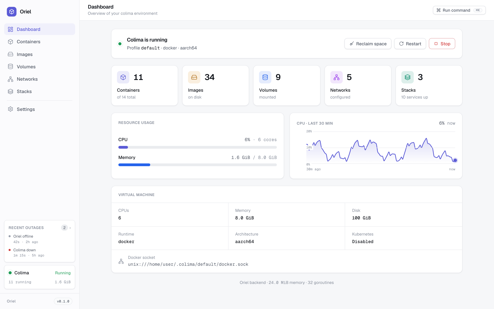
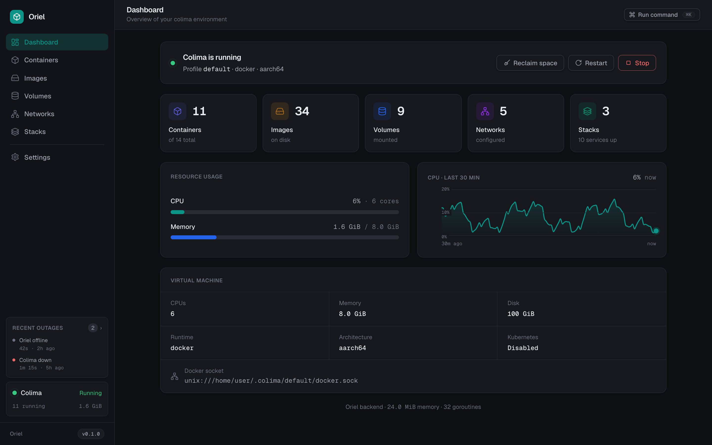
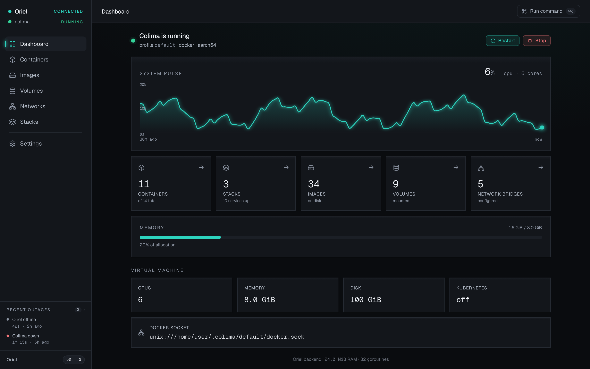

<div align="center">


# Oriel

**A fast, local, single-binary web GUI for Colima & Docker.**

Manage containers, images, volumes, networks and Compose stacks from a clean,
themeable browser UI. ~15–30 MB RAM, zero dependencies, binds to `127.0.0.1`.

[](https://github.com/ParadoxInfinite/oriel/actions/workflows/ci.yml)
[](https://github.com/ParadoxInfinite/oriel/releases)
[](LICENSE)

</div>

<p align="center">
  
  
</p>

## Install

**Quick install** — detects your platform, verifies the checksum, installs to your PATH:

```sh
curl -fsSL https://raw.githubusercontent.com/ParadoxInfinite/oriel/main/install.sh | sh
```

> ⚠️ This pipes a script into your shell, which runs as you. **[Read `install.sh`](https://github.com/ParadoxInfinite/oriel/blob/main/install.sh) before running it** — or use the explicit per-platform commands below, which do the same thing, one intentional step at a time.

**Manual** — copy the line for your platform:

```sh
# macOS · Apple Silicon (M1+)
curl -fL https://github.com/ParadoxInfinite/oriel/releases/latest/download/oriel-darwin-arm64 -o oriel && chmod +x oriel

# macOS · Intel
curl -fL https://github.com/ParadoxInfinite/oriel/releases/latest/download/oriel-darwin-amd64 -o oriel && chmod +x oriel

# Linux · arm64
curl -fL https://github.com/ParadoxInfinite/oriel/releases/latest/download/oriel-linux-arm64 -o oriel && chmod +x oriel

# Linux · amd64
curl -fL https://github.com/ParadoxInfinite/oriel/releases/latest/download/oriel-linux-amd64 -o oriel && chmod +x oriel
```

**Or with Go:**

```sh
go install github.com/ParadoxInfinite/oriel@latest
```

**Or from source:** `make build` (builds the UI, embeds it, produces `./oriel`).

## Run

```sh
./oriel              # opens http://127.0.0.1:4321
```

Flags: `--port <n>` (default 4321), `--no-open`. To run on login as a background service:

```sh
./oriel service install      # launchd (macOS) / systemd (Linux); also: status, uninstall
```

Needs a Docker Engine–compatible runtime + the `docker` CLI. [Colima](https://github.com/abiosoft/colima)
is first-class (adds VM start/stop); Docker Engine, OrbStack, Rancher/Docker Desktop,
Podman, and remote daemons also work — see [docs/DAEMONS.md](docs/DAEMONS.md).

## Features

- **Containers** — live CPU/mem, exit codes, bulk actions, streaming logs, full inspect.
- **Images** — pull with registry search, prune, digest-pinned naming, one-click tag.
- **Compose** — manage running stacks, plus discover & deploy projects from disk.
- **Reclaim space** — selectable prune as cancelable background jobs that survive a refresh.
- **Dashboard** — CPU history, memory, disk, and uptime/outage tracking.
- **Command palette** (`⌘K`) — fuzzy-run any action; optional natural-language mode.
- **Editions & themes** — swap the whole UI (Studio / Classic), light/dark/system, custom accents.
- **Live** — everything streams over one SSE connection; the UI never polls.
- **Self-update** — service installs update in-app via checksum-verified downloads.

## Editions & themes

The presentation is a swappable plugin on a stable platform SDK. Ships with
**Studio** (default; light/dark/system) and **Classic** (dark teal); recolor
either, or drop in your own. See [docs/THEMES.md](docs/THEMES.md).

<p align="center">
  
</p>

## Security

Oriel has **no authentication**, and driving Docker is effectively **root on the host**.
Run it locally, or reach it remotely over a **private network only** (Tailscale,
ZeroTier, WireGuard, …). **Never put it on the public internet.** Full trust model:
[SECURITY.md](SECURITY.md).

## More

- **Reverse-proxy subpath:** `ORIEL_BASE_PATH=/oriel ./oriel` — one build serves root or a subpath.
- **Natural-language control:** point `ORIEL_PROVIDER_URL` at a resolver; suggestions run
  through the same validated tool path, and the base binary links no ML code.
- **Develop:** `make dev` + `make dev-web` (Vite hot reload), `make test`. See [CONTRIBUTING.md](CONTRIBUTING.md).

## License

[Apache-2.0](LICENSE) © The Oriel contributors. See [NOTICE](NOTICE).
